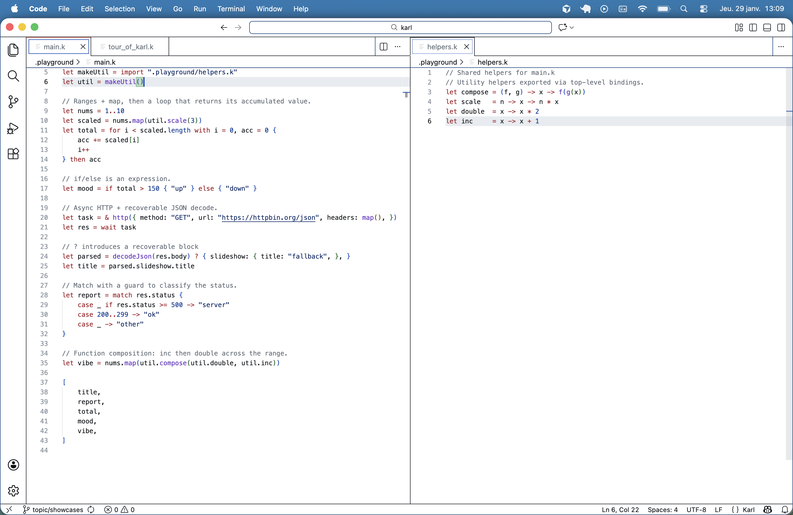

### The Karl programming language

<figure>
  
  <figcaption>Visual Studio Code plugin for Karl</figcaption>
</figure>

#### Tour of Karl

```
// Closures as first-class expressions.
let addN = n -> x -> n + x
let add5 = addN(5)
add5(10)
```

```
// Match + guards (expression-based branching).
let tempo = 160
let feel = match tempo {
    case _ if tempo >= 180 -> "🔥"
    case 120..179 -> "🎶"
    case _ -> "chill"
}
feel
```

```
// Blocks are expressions and return their last value.
let computed = {
    let x = 1
    let y = 3
    x + y
}
computed
```

```
// Destructuring + object literals (trailing comma disambiguate from blocks).
let track = { title: "Neon Steps", bpm: 160, }
let { title, bpm, } = track; // semicolon prevents parser error before ... 
{ title, bpm, } // ... returning an object literal
```

```
// 5) `for` is an expression; `then` returns the loop value.
let nums = [1, 2, 3, 4]
let sum = for i < nums.length with i = 0, acc = 0 {
    acc += nums[i]
    i++
} then acc
sum
```

```
// 6) Recoverable errors with `? { ... }`.
let raw = "{ \"bpm\": 120 }"
let data = decodeJson(raw) ? { bpm: 90, }
data.bpm
```

```
// 7) Async tasks (`&`) and `wait`.
let ping = () -> { sleep(30); "ready" }
let task = & ping()
wait task
```

Explore more examples in the `examples/` folder: [Karl Examples](examples/README.md)

### CLI

```
karl parse <file.k> [--format=pretty|json]
karl run <file.k>
cat <file.k> | karl run -
```

### Tests

```
go test ./...
```

### Specs

- `SPECS/language.md` — syntax + semantics
- `SPECS/interpreter.md` — runtime model and evaluator notes
- `SPECS/todolist.md` — short, current priorities for contributors
