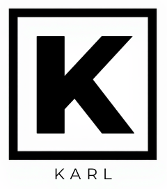

# Karl Language Support for VS Code

Beautiful syntax highlighting for the Karl programming language!



## Features

✨ **Comprehensive Syntax Highlighting**
- Keywords: `let`, `if`, `else`, `for`, `match`, `wait`, etc.
- Async operators: `&` (spawn), `|` (race)
- Arrow functions: `->`
- Built-in functions: `http`, `decodeJson`, `map`, `set`, `rendezvous`
- String and number literals
- Comments
- Shape files (`.shape`) with field/type highlighting

🎨 **Smart Formatting**
- Auto-closing brackets, quotes, and braces
- Comment toggling with `Cmd+/` (Mac) or `Ctrl+/` (Windows/Linux)
- Bracket matching

## Installation

### From VSIX (Manual)
1. Download the latest `.vsix` file from releases
2. Open VS Code
3. Press `Cmd+Shift+P` (Mac) or `Ctrl+Shift+P` (Windows/Linux)
4. Type "Install from VSIX"
5. Select the downloaded file

### From Source
```bash
cd karl-vscode
npm install
npm run package
code --install-extension karl-lang-0.1.0.vsix
```

## Usage

Open any `.k` file and enjoy beautiful syntax highlighting!
Open `.shape` files for shape definitions with dedicated highlighting.

### Example Code

```karl
// Concurrent HTTP requests with channels
let ch = rendezvous()

let worker = (id, ch) -> {
    let task = & http({
        method: "GET",
        url: "https://example.com",
        headers: map(),
    })
    
    let result = task.then(response -> {
        { id: id, status: response.status, }
    })
    
    ch.send(wait result)
}

// Spawn 3 workers
let tasks = for i < 3 with i = 0, ts = [] {
    ts += [& worker(i + 1, ch)]
    i++
} then ts

// Collect results
let results = for i < 3 with i = 0, rs = [] {
    let [r, done] = ch.recv()
    rs += [r]
    i++
} then rs

results
```

## Supported Features

### Keywords
- **Control Flow:** `if`, `else`, `for`, `while`, `break`, `continue`, `return`, `match`, `case`, `then`, `with`
- **Declarations:** `let`, `import`, `from`
- **Query:** `in`, `where`, `orderby`, `select`
- **Async:** `wait`

### Operators
- **Async:** `&` (spawn task), `|` (race tasks)
- **Arrow:** `->`
- **Comparison:** `==`, `!=`, `<`, `>`, `<=`, `>=`
- **Logical:** `&&`, `||`
- **Arithmetic:** `+`, `-`, `*`, `/`, `%`
- **Assignment:** `=`, `+=`, `-=`, `*=`, `/=`, `%=`
- **Error Recovery:** `?`
- **Range:** `..`
- **Increment:** `++`, `--`

### Built-in Functions
- **I/O:** `log`, `http`, `decodeJson`, `encodeJson`, `jsonPath`
- **Concurrency:** `rendezvous`, `send`, `recv`, `done`, `then`, `wait`, `sleep`
- **Collections:** `map`, `set`, `filter`, `reduce`, `sum`, `find`, `sort`, `length`
- **Strings:** `trim`, `toLower`, `toUpper`, `split`, `chars`, `contains`, `startsWith`, `endsWith`, `replace`
- **Error:** `fail`

## Color Themes

The extension works with all VS Code color themes! Recommended dark themes:
- **One Dark Pro**
- **Dracula**
- **Nord**
- **Tokyo Night**

## Examples

Check out the `examples/` directory in the Karl repository for:
- Monte Carlo Pi estimation with parallel workers
- Concurrent HTTP health checker
- Multi-stage pipeline architecture
- Classic algorithms (sorting, primes, fibonacci)

## Contributing

Found a highlighting issue? [Open an issue](https://github.com/yourusername/karl-vscode/issues)!

## License

MIT License - See [LICENSE](LICENSE) for details

## Credits

Created for the **Karl programming language** - elegant concurrency meets functional power!

---

**Enjoy coding in Karl!** 🚀✨
