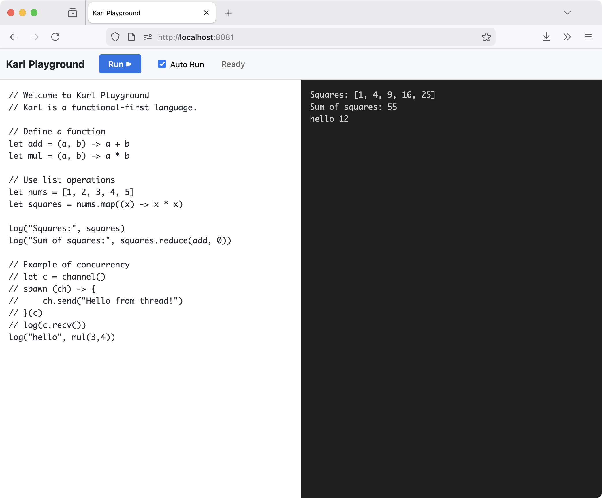

# Karl Playground



The Karl Playground is a zero-setup, browser-based environment for writing and executing Karl code. It runs the full Karl interpreter directly in your browser using WebAssembly (WASM), providing a fast and secure way to experiment with the language without any backend server requirements.

## Features

- **Instant Execution**: Run Karl code immediately in your browser.
- **Auto-Run**: Toggle automatic execution as you type (with debounce).
- **Client-Side WASM**: The interpreter runs entirely on your machine—no code is sent to a server.
- **Example Code**: Comes with a pre-loaded example demonstrating functions, list operations, and concurrency.

## Getting Started

To launch the playground locally, use the `playground` command included in the Karl CLI:

```bash
# Using the binary
karl playground

# Or running from source
go run main.go playground
```

This will start a local web server at `http://localhost:8081`. Open this URL in your browser to start coding!

## How it Works

The playground uses `syscall/js` to bridge the Go runtime (compiled to WASM) with the browser's JavaScript environment. 

1. **Compilation**: The Karl interpreter is compiled to a `.wasm` binary (`assets/playground/karl.wasm`).
2. **Execution**: When you click "Run", the WASM binary is instantiated and executed in a web worker or main thread.
3. **I/O**: Standard output (`stdout`) from the interpreter is captured by a custom JavaScript polyfill and displayed in the output pane.

## Development

If you're contributing to Karl and want to update the playground's interpreter version:

1. Make your changes to the Karl core.
2. Rebuild the WASM binary:
   ```bash
   GOOS=js GOARCH=wasm go build -o assets/playground/karl.wasm ./wasm
   ```
3. Restart the playground server.
